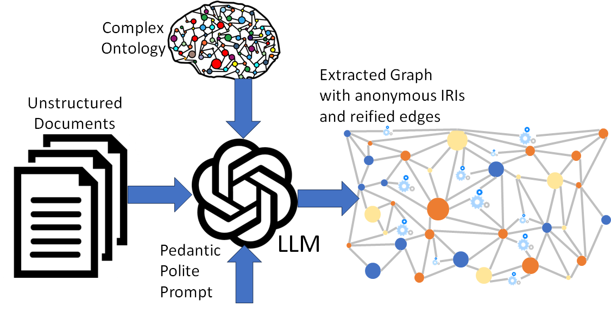

# ECE M202A/CS M213A Project
This is repository for ECEM202A / CSM213A projects (2023fall).

## Project: Quantifying Accuracy-Latency in LLMs

Contributor: [Zhuohao Li](https://github.com/Zhuohao-Li), [Ying Li](https://github.com/Fr3ya)

The repo is organized by this:

* `doc/` for website content
* `software/` for code used in the project
* `data/` for data and tasks used in the project

Our project website is availble on [https://bu9gy.github.io/](https://bu9gy.github.io/)

Our code is open-soruced and copyright by MIT licence.

